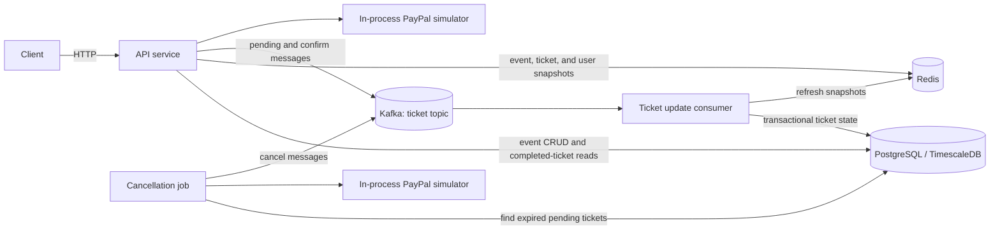
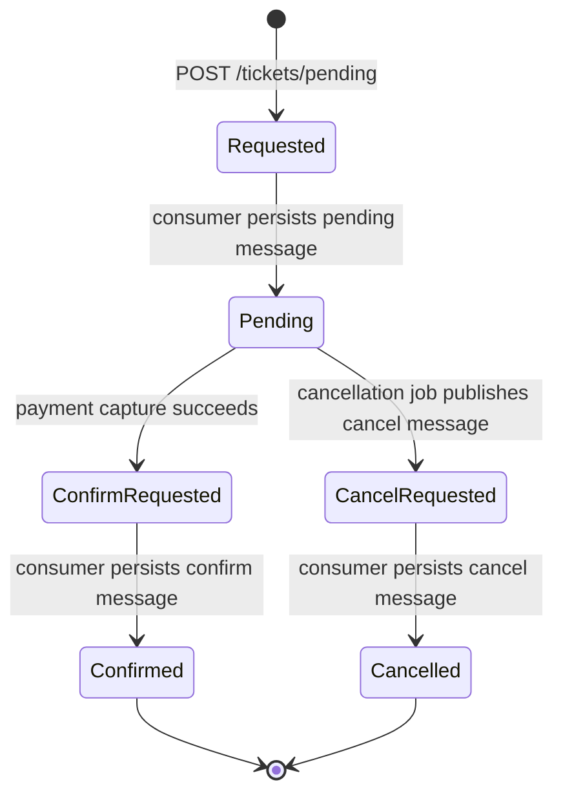

# High-Level Design

## Purpose

This project is a ticket reservation system built around asynchronous state
transitions. The HTTP API accepts event and ticket requests, Kafka serializes
ticket changes by event, the ticket update consumer persists those changes, and
the cancellation job expires reservations that are not confirmed in time.

## System context

## Runtime components

| Component | Responsibility | Source of truth or role |
| --- | --- | --- |
| API service | Event CRUD, ticket lookup, reservation requests, payment creation, and confirmation requests | Synchronous system boundary |
| Ticket update consumer | Applies `pending`, `confirm`, and `cancel` messages in batches | Sole writer for asynchronous ticket state and event counters |
| Cancellation job | Finds expired pending tickets and publishes cancellation requests | Scheduler; it does not update ticket state directly |
| PayPal simulator | Simulates create, capture, and refund operations | Process-local test double, not durable payment storage |
| PostgreSQL/TimescaleDB | Stores events, active tickets, completed tickets, users, and per-user counters | Durable source of truth |
| Redis | Stores read-optimized event, pending-ticket, client-order, and per-user snapshots | Rebuildable cache |
| Kafka | Carries ticket state-change commands | Durable asynchronous handoff |

## Ticket lifecycle

The external statuses persisted by the system are `pending`, `confirm`, and
`cancelled`. `Requested`, `ConfirmRequested`, and `CancelRequested` in the diagram
represent asynchronous gaps between publishing a Kafka message and consuming it.

## Data ownership

PostgreSQL is the durable source of truth. Active reservations are stored in
`tickets`; terminal reservations are moved to the TimescaleDB hypertable
`ticket_done`. Event statistics and the `user_ticket` reservation counters are
updated in the same database transaction as ticket transitions.

Redis contains projections used by the API:

- `events:{event_id}`: event snapshot.
- `tickets:reserved:{event_id}`: calculated remaining-ticket count.
- `tickets:{ticket_id}`: pending-ticket snapshot.
- `tickets:client-order-id:{user_id}:{client_order_id}`: idempotency lookup.
- `user_ticket:{event_id}:{user_id}`: per-event reservation count for a user.

The consumer reconciles its assigned event shards from PostgreSQL when it starts
and refreshes affected cache entries after each committed database batch. Cache
write failures do not roll back PostgreSQL.

## Kafka partitioning and delivery

The `ticket` topic has 100 partitions. A ticket message uses
`event_id % 100` as both its Kafka key and its exact partition, ensuring that all
changes for an event stay on one ordered shard. A consumer instance opens readers
only for its configured `message_keys`; two live consumers must not own the same
keys.

Messages are processed with at-least-once semantics. A batch is committed to
PostgreSQL before Kafka offsets are committed. Existing active or completed ticket
IDs and invalid state transitions are ignored, making retries idempotent at the
ticket processor level.

## Consistency model

Ticket commands are eventually consistent: an accepted API request means Kafka
accepted the command, not that PostgreSQL already reflects it. Event statistics,
pending snapshots, and terminal ticket visibility become current after the ticket
update consumer processes the message.

The API performs fast availability and per-user-limit checks against Redis, while
the consumer repeats the per-user-limit check against transactional state. The
consumer is therefore the authoritative enforcement point for persisted tickets.

## Deployment boundaries

The three Go entrypoints are independent processes:

- `cmd/api`
- `cmd/update_ticket_consumer`
- `cmd/cancellation_job`

PostgreSQL, Redis, and Kafka are started with Docker Compose for local development.
The PayPal simulator is constructed inside the API and cancellation processes; it
is not a standalone service and its state is neither durable nor shared between
those processes.
